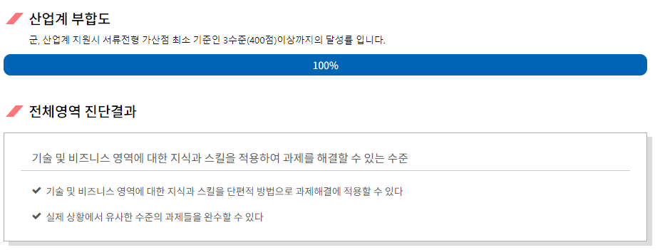
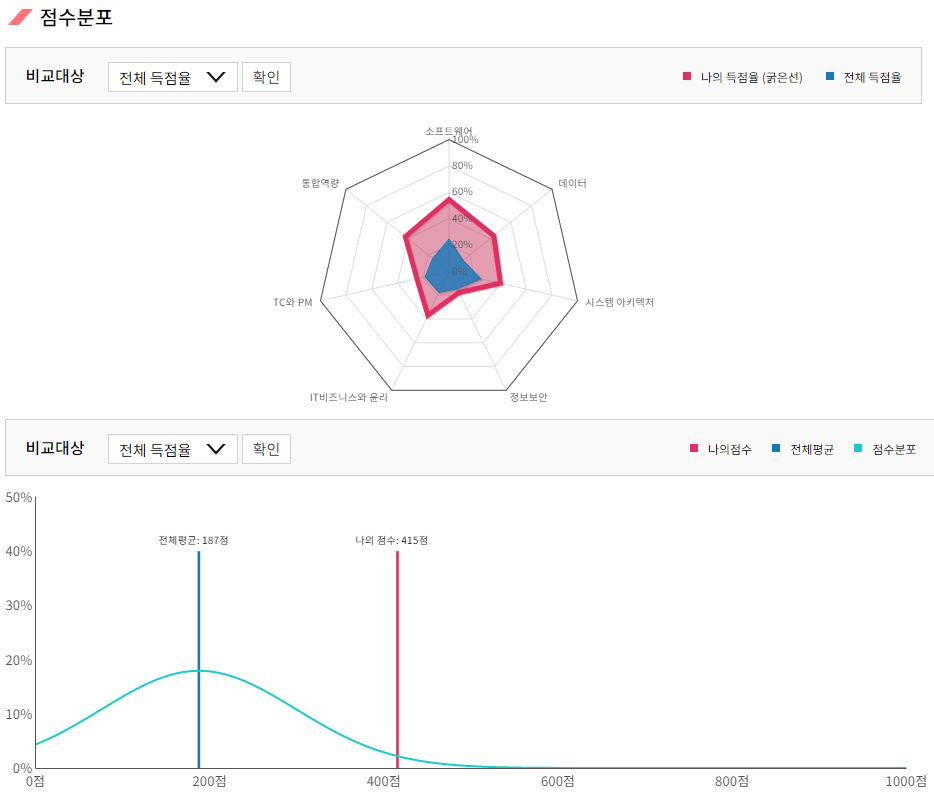

# Portfolio :clipboard:
배정은, <b>JeongEun Bae</b></br>
동의대학교 컴퓨터소프트웨어공학과 4학년 1학기 재학 <b>中</b>

관심 연구 분야 :  Natural Language Processing, Machine Learning, Computer Vision

---
```2019.04 ~```<br>

동의대학교 컴퓨터소프트웨어공학과 이종민 교수님의 Computer Network & Robot Software(ROS) 연구실 소속입니다.</br>
Email : je_0922@naver.com</br>
Phone : (+82) 010-8380-0922

### 연구실 활동 :mortar_board:
- <b>ROS(Robot Operation System)</b>
  - ROS의 각 패키지 분석 및 사용법에 대한 세미나 진행
  - ROS를 활용한 항만도로자율주행시스템 분석
  - ROS를 활용한 미로 탈출 시스템 분석, 설계 및 구현에 대한 세미나 진행
  - ROS 운전기능주행시험 자율주행시스템 분석에 대한 세미나 진행
  
- YOLO를 사용한 사람, 사물 인식 및 각 패키지 분석
- GPU 사용법 세미나 진행 - YOLO 기본 환경
- YOLO를 활용한 엘리베이터 버튼 인식 

- Design Pattern 
- C++ Reference 분석
- 자료구조, 알고리즘을 활용하여 문제 해결 
- The Java® Language Specification 분석
- 소프트웨어 품질 관리 및 Git을 사용한 형상 관리

### 학술논문 :books:
- '재난 극복을 위한 소상공인 기부 및 소비 촉진 플랫폼 설계 및 구현', ```2020 한국정보처리학회 추계학술발표대회``` [ 2020. 10. 19 ]
( Design and Implementation of a Platform to Promote Donation and Consumption of Small Businesses to Overcome Disasters )
  - 정인환 ( In-hwan Jeong ) , 배정은 ( Jung-eun Bae ) , 김한비 ( Han-bi Kim ) , 하현준 ( Hyun-joon Ha ) , 이수영 ( Soo-young Lee ). 2020. 재난 극복을 위한 소상공인 기부 및 소비 촉진 플랫폼 설계 및 구현. 한국정보처리학회 학술대회논문집, 27(2): 713-716

  > Abstract

  >  본 논문에서는 소상공인들이 온라인에서 물품을 등록하고 판매할 수 있는 전용 공간이며 크라우드 도네이션 기능을 제공하는 플랫폼을 제안했다. 크라우드 도네이션이란 재난 발생시 특정 지역
에 필요한 물품을 소상공인에게서 얻고 소비자가 크라우드 펀딩 형식으로 가격을 지불한 후 플랫폼에서 자체적으로 재난 지역에 구호 물품을 배송해주는 것이다. 제안한 플랫폼을 웹으로 구현하였다.

- '칫솔모 상태 판별을 위한 객체 탐지 시스템에 관한 연구', ```2021 한국정보기술학회 대학생논문경진대회``` [2021.06.04]
( A Research on Object detection system for determining toothbrush cap status )
  - 배정은, 전규빈, 장희숙. (2021). 칫솔모 상태 판별을 위한 객체 탐지 시스템에 관한 연구. 한국정보기술학회 종합학술발표논문집, (), 643-647.
  
  > Abstract
  
  > 칫솔모가 마모될 경우 치면세균막 제거율이 많이 떨어지고 세균의 수도 증가하게 된다. 칫솔모의 상태는 치아 관리에 영향을 미치므로 새로운 칫솔로 교환해야 한다. 이에 본 연구에서는 칫솔모의 상태를 확인하여 변경을 권고하는 시스템을 연구 개발하였다. 학습 과정은 약 3970개의 칫솔모 이미지를 수집하고 YOLO 신경망을 활용하여 학습 결과물을 도출하였다 본 시스템은 모델 성능 평가(mAP) 99.67%, 정밀도(Precision) 99% 정도로 우수한 성능을 보여준다.


- '교사를 위한 AI 학습 콘텐츠 추천 및 제작 플랫폼에 관한 연구', ```2021 한국경영정보학회 학술대회(한국인터넷전자상거래학회)``` [2021.06]
  - 배정은,장희숙. "교사를 위한 AI 학습 콘텐츠 추천 및 제작 플랫폼에 관한 연구" 2021 한국경영정보학회 춘계통합학술대회 (2021): 282-287.
  
  > Abstract

  > This study utilizes AI to recommend customized learning content to reduce the burden of teacher's class content production, and conducts research on educational platforms that analyze students' insufficient learning capabilities and also recommend content for them.

- 'AI 콘텐츠 추천 및 제작 플랫폼에 관한 연구 (유아의 콘텐츠 소비 성향 분석을 기반)', ```2021 한국통신학회 하계학술대회``` [2021.06]
  - 

### 자격증 :crown: 
- 2017.03.24 리눅스 마스터 2급 ```한국정보통신진흥협회```
- 2017.03.21 네트워크 관리사 2급 ```한국정보통신자격협회``` [ ~ 2022.03.20 ]
- 2017.08.16 정보처리기능사 ```한국산업인력공단```
- 2020.08 ~ 2020.12 DSAC 데이터 사이언티스트 능력인증자격 2급(전문가) ```kpc(한국생산성본부)```
- 2021.06.02 정보처리기사 ```한국산업인력공단```
<br></br>
- **Certificate** :sparkles:
  - DSAC Data Scientist Academy & Certificate **Data Programming** ```Passed``` [ 2020. 08. 14 ]
  - DSAC Data Scientist Academy & Certificate **Data Process Analysis** ```Passed``` [ 2020. 09. 04 ]
  - DSAC Data Scientist Academy & Certificate **Machine Learning** ```Passed``` [ 2020. 09. 22 ]
  - DSAC Data Scientist Academy & Certificate **Deep Learning** ```Passed``` [ 2020. 12. 04 ]
<br></br>
- **과정 수료**
  - DSAC 데이터 사이언티스트 능력인증자격 전문교육훈련과정 ```M1.Data Programming 교육과정``` 수료 [ 2020. 08. 03 ~ 2020. 08. 06 ]
  - DSAC 데이터 사이언티스트 능력인증자격 전문교육훈련과정 ```M2.Data Process & Analysis 교육과정``` 수료 [ 2020. 08. 24 ~ 2020. 08. 27 ]
  - ISTQB SW Testing Foundation 국제 소프트웨어 테스팅 ```자격취득 교육``` 수료 [ 2020. 09. 16 ~ 2020. 09. 18 ]
  - DSAC 데이터 사이언티스트 능력인증자격 전문교육훈련과정 ```M3.Machine Learning 교육과정``` 수료 [ 2020. 09. 12 ~ 2020. 09. 20 ]
  - DSAC 데이터 사이언티스트 능력인증자격 전문교육훈련과정 ```M4.Deep Learning 교육과정``` 수료 [ 2020. 11. 21 ~ 2020. 11. 29 ]

### 소프트웨어 역량 검정(TOPCIT) :trophy:
- 2021.05.22 TOPCIT, 3수준 415점(평균 득점 : 187.0점 상위 10% 득점 : 417.9점) 
- **산업계 부합도 및 전체영역 진단결과**


- **점수 분포**


### 외국어 성적 :abcd:
- 2020.04.06 OPIC 영어(English), IL(Intermediate Low) [ ~ 2022.03.29 ]

### 경력 및 교내 활동 내역 :raised_hands:
- <b>경력 :gem:</b>
  - Im4u 정보영재컴퓨터학원 ```강사``` [ 2018.02 ~ 2019. 04 ]
  - 동의대학교 컴퓨터소프트웨어공학과 이종민 교수님 연구실 소속 ```연구생``` [ 2019. 04 ~ 현재] 
  - 한국전자통신연구원(ETRI) ```하계연구연수생``` [ 2021.07 - 2021. 08 ]

- <b>교내 활동 내역 :diamonds:</b>
  - 동의대학교 컴퓨터소프트웨어공학과 학생회 ```홍보부장``` [ 2019. 01 ~ 2020. 01 ]
  - 2019 동의대학교 고교썸머스쿨 ```보조교사 겸 수업``` [ 2019. 07. 22 ~ 2019. 07. 27 , 동의대학교 ] 
  - 인도네시아 교사 연수 세미나 ```보조교사``` [ 2019. 08. 02, 동의대학교 ]
  - 동의대학교 인재개발처 BOB 취업동아리 Junior ```대기업반``` [ 2020. 05 ~ 2021. 01 ]
  - 동의대학교 2020-1학기 전공튜터링 ```튜터``` [ 2020.05 ~ 2020. 06 ]
  - 2020 동의대학교 고교윈터스쿨 ```보조교사 겸 수업``` [ 2021. 01. 04 ~ 2021. 01. 09 ]
  - 2020 동의대학교 고교진로탐방(남성여자고등학교) ```보조교사``` [ 2020. 12. 23 ]

- <b>봉사 활동</b>
  - 은성제과제빵커피학원-제빵나눔활동 [ 2019. 02. 19, 1365 김해시자원봉사센터 ]
  - 베트남 하노이 해외 봉사(제빵봉사활동) [ 2019. 07. 04 ~ 2019. 07. 05, 1365 김해시자원봉사센터] 
  - 2019년 '내가 만든 사랑 가득 케이크' 행사 봉사활동 [ 2019. 12. 20, 김해시자원봉사센터 ]
  - 청소년 대상 메이커스 및 소프트웨어교육 진행 [ 2021. 05. 17, 부산광역시사회복지협의회 ]

### 대외 활동 내역 및 수상 실적  :boom:
- <b>대외 활동 내역</b> :star2:
  - 2020 한이음 ICT 멘토링 참가 ( 재난 극복을 위한 소상공인 기부 및 소비 촉진 플랫폼 프로젝트 진행 ) ```멘토 라인플러스 소속 김유진```
  - 2020 한이음 ICT 멘토링 참가 ( 딥러닝 기반 초,중 SW코딩 교육몰 구축(웹-앱) ) ```멘토 한국정보통신기술사협회 소속 방중수```
  - 2020 소프트웨어 개발 보안 경진대회(소프트웨어 개발보안 시큐어코딩 해커톤) 참가 ( 유해식품 식별 웹 플랫폼 프로젝트 진행 ) ```행정안전부```
  - 2020 클라우드 비즈니스 아이디어 공모전 참가 ( 교사를 대상으로 한 온라인 강의 및 학습 콘텐츠 제작 플랫폼 개발 아이디어 제출 ) ```부산광역시, (재)부산정보산업진흥원, (주)더존비즈온```
  - 2021 한국정보기술학회 대학생논문경진대회 참가 ( 칫솔모 상태 판별을 위한 객체 탐지 시스템에 관한 연구 논문 제출 ) ```한국정보기술학회```
  - 2021 춘계통합학술대회 대학(원)생 아이디어 공모전 참가 ( 치아 관리 서비스 (To's) 아이디어 제출 ) ```한국경영정보학회```

- <b>알고리즘 대회</b>  :star2:
  - 2020 Google Code Jam, Qualification Round 통과 [ 2020. 04 ~ 2020.05 (GMT + 9) ]

- <b>수상 실적 :trophy:</b>
  - 2020 클라우드 비즈니스 아이디어 공모전 최우수상 수상 ```(주)더존비즈온```[ 2020. 09. 28 ]
  - 2020 동아리연계캡스톤디자인Ⅰ 프로젝트 발표회 우수상(총장상) 수상 ```동의대학교``` [ 2020. 12. 29 ] 
  - 2021 한국정보기술학회 대학생 논문경진대회 우수논문상(동상) 수상 ```한국정보기술학회``` [ 2020. 06. 04 ]
  - 2021 춘계통합학술대회 대학(원)생 공모전 장려상 수상 ```한국경영정보학회``` [ 2020. 06. 19 ]

### 수행 프로젝트 및 경험 :seedling:
- **치아 관리 서비스 TO'S**
  - 올바른 치아 습관 및 치아 건강을 위한 사용자 맞춤 치아 관리 서비스 Android 애플리케이션
  - Platform : Android / Tech : Android Studio, Spring, **YOLO** / Language : JAVA, PYTHON
  - 수행한 역할 :  치아 관리 서비스인 To'S의 칫솔 교체 주기 알림이 기능 개발 ( 객체 인식 모듈인 YOLO를 활용한 칫솔모의 상태를 판별하여 마모 상태 결과에 따른 교체 주기를 사용자에게 알려준다. ) ```팀원, 인공지능 파트```
<br></br>
  > 마모된 칫솔모를 사용할 경우 마모되지 않은 칫솔을 사용할 때보다 세균의 수가 증가하여 치아 건강에 영향을 미치므로 칫솔모의 상태를 파악할 수 있는 시스템 구현하였다. 사용자가 휴대폰 카메라로 칫솔모의 사진을 찍은 후 사진을 분석한다. 
  
  > 이를 학습된 가중치 파일을 통해 정상 칫솔모, 비정상 칫솔모로 분류할 수 있도록 구축하였다. 시스템에 대한 모델 성능 평가는 약 99.67%라는 결과를 얻어 성공적으로 연구를 진행하였고 프로젝트를 완성하였다.

  > 진행한 연구를 ‘칫솔모 상태 판별하는 객체 탐지 시스템에 관한 연구’라는 주제로 2021년 한국정보기술학회 하계학술대회 대학생 논문경진대회에 참가하여 논문을 제출하여 우수논문상(동상)을 수상하게 되었다.

- **AR를 활용한 학과 안내 애플리케이션 Co-ARi**
  - 강의실을 찾지못하거나 학과 강의실 정보가 부족한 신입생, 재학생을 위한 증강현실 학과 안내 Android 애플리케이션
  - Platform : Android, Web / Tech : Android Studio, **Spring Boot**, Web(HTML, JAVASCRIPT, CSS), **ARCore** / Language : JAVA, HTML, JAVASCRIPT, CSS
  - 수행한 역할 : 학과 정보 저장 및 제공하는 서버 개발, 증강현실을 활용한 학과 정보 출력 기능 개발 ( 클라이언트(안드로이드)에서 학과 정보, 앵커 정보 등을 요청할 시 그에 대한 정보를 제공한다. 또한, 제공받은 학과 정보와 앵커 위치 정보를 활용하여 AR 환경으로 사용자에게 보여준다.) ```팀장, BACKEND, AR 파트```
<br></br>
  > 학과 호실의 동적인 정보를 Google에서 제공하는 AR Core 라이브러리를 사용한 증강현실 내에 보여줘 사용자들이 쉽게 제공받을 수 있도록 구현하였다.

  > 정보를 제공하는 서버는 MVC 패턴으로 Spring Boot을 활용해 구축하여 REST API를 통해 JSON 파일을 통해 전달하고 저장하도록 구현하였다. 정보는 앵커 정보(호실 강의실 정보), 알림 정보, 사용자 정보, 공지사항 정보, 학과소식 정보, 졸업생 정보를 제공한다.

- **교사를 대상으로 한 온라인 강의 및 학습 콘텐츠 제작 플랫폼 CEDU**
  - COVID19로 인해 교사 업무가 과중되므로 넷플릭스’, ‘YouTube’와 같은 플랫폼에서 사용되는 알고리즘을 비대면 수업과 연관 지어 교사가 가지는 수업 콘텐츠 제작의 부담을 덜 수 있는 '교사를 위한 학습 콘텐츠 추천 및 제작 플랫폼' 아이디어 제안 및 연구 진행
  - Platform : Web / Tech : ReactJS, Spring Boot, Machine Learning(sklearn 라이브러리 사용), KNN 기법 사용 / Language : PYTHON
  - 수행한 역할 : 아이디어 제안 및 필터링 알고리즘을 활용하여 추천 알고리즘 설계
<br></br>
  > 사용자에게 학습 콘텐츠를 추천하여 학습할수 있도록 하는 기능을 제작하였다. 학습 콘텐츠 추천 기능은 머신러닝을 활용한 콘텐츠 기반 필터링 알고리즘과 딥러닝 기법인 KNN 활용한 협업 필터링 알고리즘을 조합한 하이브리드 추천 알고리즘 방식으로 설계하였다.
  
  > 이에 관한 연구 설계는 ‘교사를 위한 AI 학습 콘텐츠 추천 및 제작 플랫폼에 관한 연구’라는 주제로 2021년 한국경영정보학회 하계학술대회에 참가하여 논문을 제출하였다.    
  
  > 해당 연구 주제를 클라우드 서비스에 접목해 ‘교사를 대상으로 한 온라인 강의 및 학습 콘텐츠 제작 플랫폼’이라는 아이디어로 2020년 부산정보산업진흥원에서 주최한 클라우드 비즈니스 아이디어 공모전에 참가하였고, 최우수상이라는 결과를 얻었다.

- **은성제과제빵커피학원 웹 페이지 외주 작업**
  - Adobe Flash Player가 종료되어 swf 파일로 주로 이루어진 홈페이지가 제대로 동작하지 않았고 이 문제점을 보완하기 위해 HTML로 변경하는 프로젝트를 진행
  - Platform : Web / Tech : Web(HTML, JAVASCRIPT, CSS), PHP / Language : HTML, JAVASCRIPT, CSS
<br></br>

  > 정적파일인 HTML, CSS, 동적 파일인 Javascript와 그를 처리하는 PHP를 사용하여 고객의 요구사항에 맞춰 작업을 진행하였다. 이 경험을 토대로 실제 고객과 작업을 진행하면서 고객의 니즈에 맞춰 소프트웨어의 품질을 높이는 활동을 배우게 되었다. 

- **사용자 맞춤 정보 캘린더 SPEC**
  - 취업 준비생이나 대외활동의 정보를 얻고 싶은 대학생 또는 자기계발 하고 싶은 누구에게나 사용자의 관심 분야를 기반으로 한 정보를 알려주며, 사용자의 일정 관리도 돕는 Android 애플리케이션
  - Platform : Android / Tech : Android, Spring Boot / Language : JAVA
  - 수행한 역할 : 안드로이드에서 요청한 정보를 제공하는 서버를 개발하고 정보를 저장하기 위해 웹 크롤링을 통해 정보를 가져온 역할을 수행했다. ```팀장, BACKEND 파트```
<br></br>

  > 애플리케이션 ‘SPEC’은 취업 준비생, 대학생 또는 누구나 자기계발을 할 수 있게 맞춤 정보, 공모전, 자격증, 어학 등 개인적인 스펙을 올리는 것과 동시에 주변의 축제까지 소개해 폭 넓은 나이층을 가질 수 있고 그 모든 것을 일정에 등록해 개인적인 일정관리까지 돕는 앱이다. 
  
  > 일정 관리 기능, 사용자 맞춤 정보 추천, 활동 신청 기능, 일정 검색 기능, 마이 페이지 기능을 사용자에게 제공한다.

  > 정보를 제공하는 서버는 MVC 패턴으로 Spring Boot을 활용해 구축하여 REST API를 통해 JSON 파일을 통해 전달하고 저장하도록 구현하였다.
 
- **ROS를 활용한 MAZE System, RobotSystem**
  - 주어진 미로 지도에서 로봇이 도착점에 도달 한 뒤 다시 시작점으로 가면서 미로를 탈출하는 시스템
  - 주어진 공간에서 로봇 청소기가 외곽선을 따라, 이동하며 청소할 구역을 탐색한 후 시작점으로 이동하여 본격적으로 장애물 또는 벽을 감지하여 우회하면서 청소하는 시스템
  - Platform : Linux / Tech : ROS / Language : PYTHON
  - 수행한 역할 : ROS를 활용한 로봇 미로 탈출 시스템 개발 ```팀장, 미로 탈출 시스템 개발 파트```
<br></br>
  > LaserScan에서의 scan 토픽을 구독하여 [전방, 후방, 좌측, 우측] 데이터 형식으로 처리하여 Lidar 센서의 데이터를 저장한다.

  > 저장된 데이터를 활용하여 벽을 피하고 BFS 알고리즘인 너비우선탐색을 통해 길을 탐색 하여 Back Tracking으로 경로를 만들어갔다.

- **유해식품 식별 웹 플랫폼, 도르리**
  - 포스트코로나시대에 맞춰 언택트 서비스가 활성화되어 쇼핑몰 사이트에서 유해 식품을 판별하여 사용자에게 정보를 알려주는 웹 플랫폼과 구글 확장 프로그램을 개발
  - Platform : Web, Google Chrome Extension / Tech : React, Spring Boot / Language : HTML, JAVASCRIPT, CSS, JAVA
  - 수행한 역할 : React를 사용하여 웹 플랫폼 Front-End 제작 ```팀원, FrontEnd 파트```
<br></br>
  > 행정안전부에서 주최하는 제7호 소프트웨어 개발 보안 경진대회에 출전하여 쇼핑몰사이트에서 유해 식품을 식별하여 사용자에게 정보를 알려주는 웹 플랫폼과 구글 확장 프로그램을 시큐어 코딩에 접목해 개발

  > MVC 패턴을 활용하여 서버에서 제공된 JSON 파일을 활용하여 사용자에게 보여주는 View 작업을 진행하였다.

- **재난 극복을 위한 소상공인 기부 및 소비 촉진 플랫폼, ConnectUs**
  - COVID19로 인해 비대면 소비가 증가하면서 소상공인의 매출 하락이 문제 되므로 소상공인들이 온라인에서 물품을 등록하고 판매할 수 있는 전용 공간을 제공하고 크라우드 도네이션 기능을 제공하는 플랫폼
  - Platform : Web / Tech : React, Spring Boot / Language : HTML, JAVASCRIPT, CSS, JAVA
  - 수행한 역할 : React를 사용하여 웹 플랫폼 Front-End 제작 ```팀원, FrontEnd 파트```
<br></br>
  > '한국정보산업연합회'에서 주관하는 ICT 한이음 멘토링에 참가하여 타 학교 학생들과 프로젝트를 진행하였다. 멘토는 라인에서 근무하는 현직 개발자로, 팀원에게 실무 관련 지식과 실무와 밀접하게 프로젝트 방향성을 잡아주셨다. 

  > 이 멘토링에서 실무에서 사용하는 기술인 Spring과 AWS 적용 및 프로젝트 관리의 경험을 얻게 되었으며, 멘토링이 끝난 후, ‘재난 극복을 위한 소상공인 기부 및 소비 촉진 플랫폼 설계 및 구현’이라는 논문 주제로 2020 한국정보처리학회 학술대회논문집에 게재하였다.
  
- **동의대학교 행복기숙사 관리 시스템**
  - 행복기숙사 호실 관리, 관생 관리, 식당 관리 기능을 포함한 전반적인 기숙사 관리 시스템
  - Language : PL/SQL 
  - 수행한 역할 : 호실 정보 입력, 관생 정보 입력, 식당 정보 입력, 출입 정보 입력과 같은 Create 기능 개발 ```팀장 Create 파트```
  
- **컴퓨터소프트웨어공학과 커뮤니티 시스템 CSE-Communication-Service**
  - COVID19로 인해 등교하지 못하는 신입생의 고충을 덜기 위해 학과 생활 정보와 과제, 궁금증 등을 공유할 수 있는 프로그램
  - Language : JAVA
  - 수행한 역할 : 채팅 기능, 클라이언트 요청에 따른 데이터 정보 전달하는 서버 개발 및 데이터베이스 개발, 클라이언트 GUI ```팀장, FullStack```
<br></br>
  > Design Pattern을 활용하여 소프트웨어 품질을 높여 개발하였다. Iterator Pattern을 게시판 기능에 적용하고, Observer Pattern을 댓글 알림 기능에 적용하였으며, Proxy Pattern, State Pattern를 활용하여 채팅 기능을 적용하였고 생성패턴인 Builder Pattern을 적용하여 구성하였다.
  
  > 서버는 Java.net의 Socket을 사용하여 Singleton Pattern을 적용하여 구축하였다.  

### 사용 가능한 언어 :capital_abcd:

- C
- C++
- JAVA
- PYTHON
